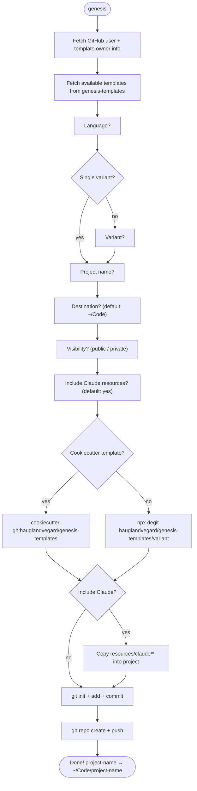

```mermaid
graph TD

    start(["genesis"])

    start --> gh["Fetch GitHub user + template owner info"]
    gh --> templates["Fetch available templates from genesis-templates"]

    templates --> q1["Language?"]

    q1 --> single{"Single variant?"}
    single -- yes --> q3
    single -- no --> q2["Variant?"]
    q2 --> q3

    q3["Project name?"]
    q3 --> q4["Destination? (default: ~/Code)"]
    q4 --> q5["Visibility? (public / private)"]
    q5 --> q6["Include Claude resources? (default: yes)"]

    q6 --> dispatch{"Cookiecutter template?"}
    dispatch -- yes --> cc["cookiecutter gh:hauglandvegard/genesis-templates"]
    dispatch -- no --> dg["npx degit hauglandvegard/genesis-templates/variant"]

    cc --> claude
    dg --> claude

    claude{"Include Claude?"}
    claude -- yes --> copy["Copy resources/claude/* into project"]
    claude -- no --> git
    copy --> git

    git["git init + add + commit"]
    git --> repo["gh repo create + push"]
    repo --> done(["Done! project-name → ~/Code/project-name"])
```
